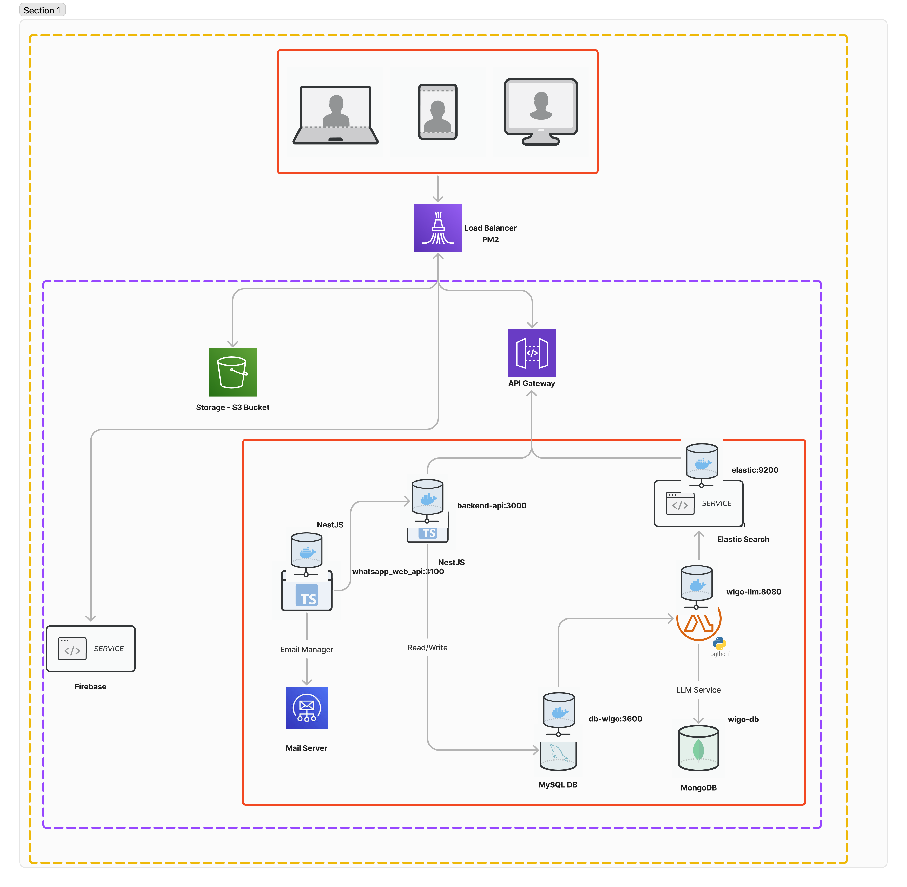
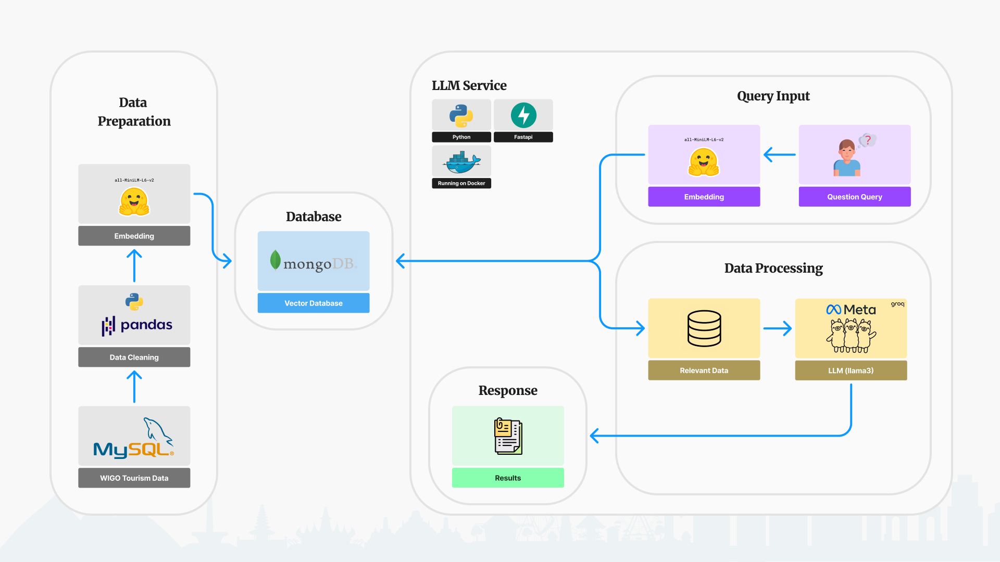

   

## Overview
WIGO is a comprehensive tourism and attraction platform aimed at providing an all-in-one solution for users to manage their travel journeys. It covers needs such as ticketing, media promotion, government promotion, and also supports POS systems for tourism businesses. The system is designed with a service-oriented architecture that includes:

- **Backend API**: Built with **NestJS**
- **Client Mobile App**: Developed with **Flutter**
- **LLM-based Recommendation System**: Implemented in **Python**

---

## Table of Contents

- [Overview](#overview)
- [Table of Contents](#table-of-contents)
- [Architecture Overview](#architecture-overview)
  - [1. Backend API (Node Js)](#1-backend-api-node-js)
  - [2. Mobile App (Flutter)](#2-mobile-app-flutter)
  - [3. LLM Recommendation System (Python)](#3-llm-recommendation-system-python)
- [Technologies Used](#technologies-used)
- [License](#license)

---

## Architecture Overview

The WIGO platform consists of three main components:

### 1. Backend API (Node Js)
Handles the core logic, routes, authentication, database management, and integrations with third-party services like payment gateways.
  
### 2. Mobile App (Flutter)
The client-side interface used by tourists and tourism businesses to interact with the WIGO platform. It provides users with easy access to booking services, POS systems, and recommendations.

### 3. LLM Recommendation System (Python)

1. **Data Preparation**: The process starts with cleaning tourism data from MySQL using Pandas. Then, this cleaned data is turned into embeddings (numerical data) that can be searched quickly.

2. **Database**: The embeddings are stored in a MongoDB vector database, which helps in finding relevant information when users ask questions.

3. **LLM Service**: The user asks a question, which is turned into an embedding (query input). This embedding is used to search the database for relevant data. The data is then processed using the *Llama3* AI model from Meta to generate a response.

4. **Response**: The final response is generated based on relevant data and *Llama3*'s AI processing, and is then shown to the user as a result.

Processes big data of tourism and attraction places to provide AI-powered suggestions using the **Llama 3 model** for personalized user experiences. It interfaces with the backend to deliver intelligent recommendations based on user queries.

---

## Technologies Used

- **Backend API**: [NestJS](https://nestjs.com/)
- **Mobile App**: [Flutter](https://flutter.dev/)
- **LLM Application**: Python
    - Libraries: `pandas`, `huggingface`, `langchain`, `llama3`
- **Database**: PostgreSQL
- **Authentication**: JWT, OAuth2
- **DevOps**: Docker, Kubernetes

---

## License

This project is licensed under the MIT License - see the LICENSE file for details.

--- 

**Contact**: If you have any questions or need assistance, feel free to reach out at [contact@wigo.com].
